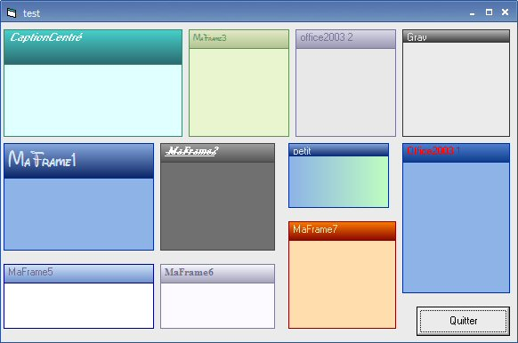



## Ma Frame

### Description

** PLEASE VOTE ** The first version of my Frame control. Includes header,gradient color, ambient backcolour, differents border lines, ability to change each border line's colour separately, etc...(it's a beta version)

SEE SCREENSHOT
 
### More Info
 

             |
---                |---
**Submitted On**   |2004-12-12 10:33:38
**By**             |[Flex dit Tannos](https://github.com/Planet-Source-Code/PSCIndex/blob/master/ByAuthor/flex-dit-tannos.md)
**Level**          |Intermediate
**User Rating**    |4.5 (54 globes from 12 users)
**Compatibility**  |VB 6\.0
**Category**       |[Custom Controls/ Forms/  Menus](https://github.com/Planet-Source-Code/PSCIndex/blob/master/ByCategory/custom-controls-forms-menus__1-4.md)
**World**          |[Visual Basic](https://github.com/Planet-Source-Code/PSCIndex/blob/master/ByWorld/visual-basic.md)
**Archive File**   |[Ma\_Frame18315312202004\.zip](https://github.com/Planet-Source-Code/flex-dit-tannos-ma-frame__1-57818/archive/master.zip)

